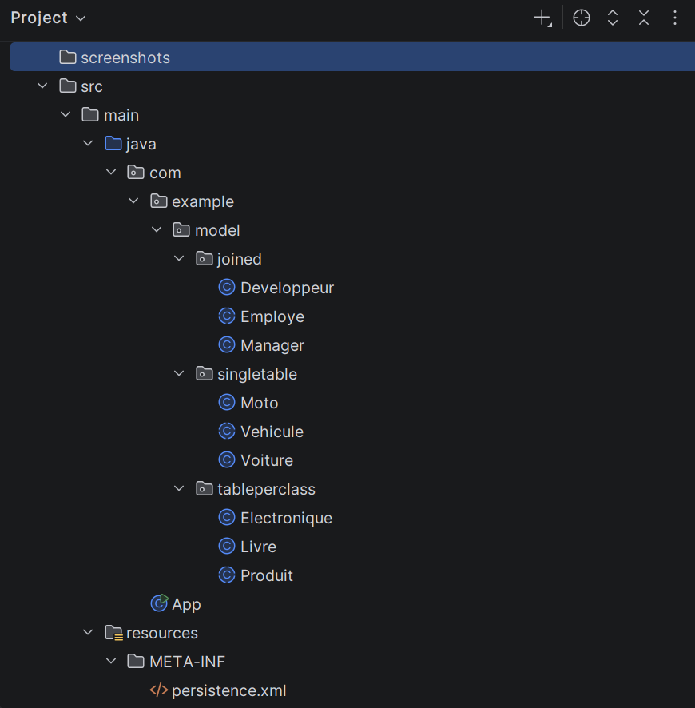
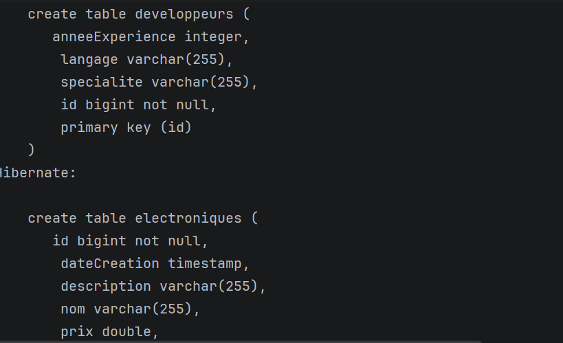
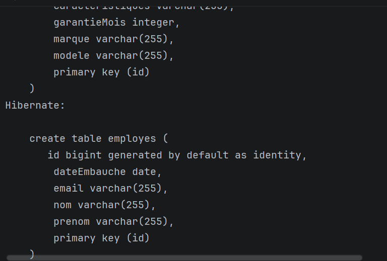
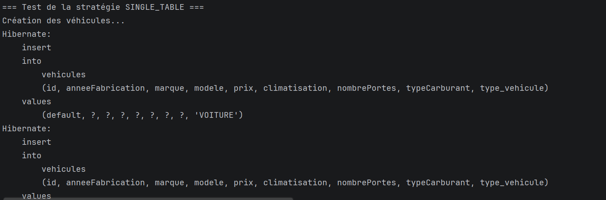
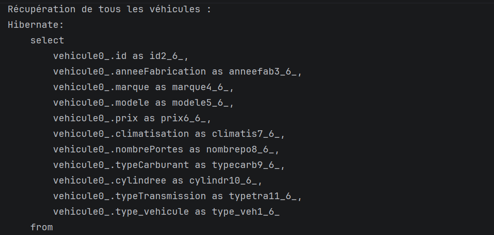
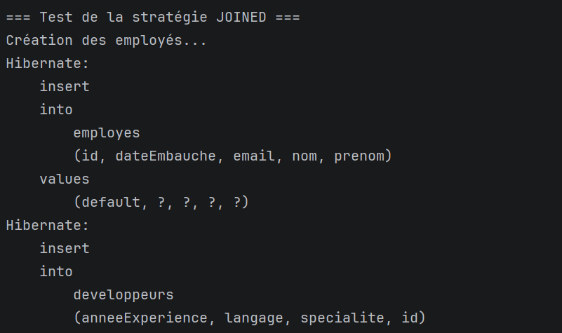
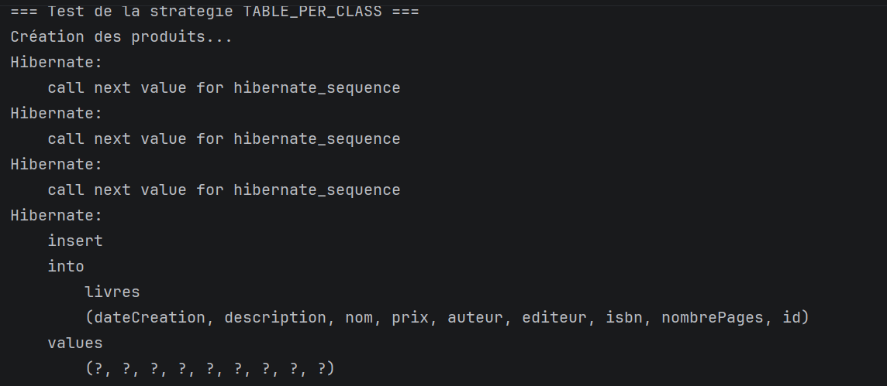

# TP 4 : Héritage avec Hibernate

## Description
Projet Maven (Hibernate 5.6.5, H2) qui implémente les trois stratégies
d'héritage JPA : SINGLE_TABLE, JOINED et TABLE_PER_CLASS.

## Structure du projet

## Comparaison des stratégies

| Stratégie | Hiérarchie | Tables | Avantages | Inconvénients |
|---|---|---|---|---|
| SINGLE_TABLE | Vehicule, Voiture, Moto | 1 (`vehicules`) | Rapide, pas de jointure | Colonnes nulles |
| JOINED | Employe, Developpeur, Manager | 3 | Normalisé, pas de nulls | Jointures nécessaires |
| TABLE_PER_CLASS | Produit, Livre, Electronique | 2 | Tables indépendantes | `union all`, colonnes dupliquées |

## 1. SINGLE_TABLE
Une seule table `vehicules`, avec la colonne discriminante `type_vehicule`
(valeurs `VOITURE` et `MOTO`).

## 2. JOINED
Une table `employes` pour les attributs communs, et une table par sous-classe
(`developpeurs`, `managers`) liée par clé étrangère.

## 3. TABLE_PER_CLASS
Une table par classe concrète (`livres`, `electroniques`), chacune avec toutes
les colonnes héritées. Les identifiants viennent de `hibernate_sequence`
(`GenerationType.AUTO`).

## Exécution
Lancer `App.java` depuis l'IDE.

## Auteur
Sara Ouaday
